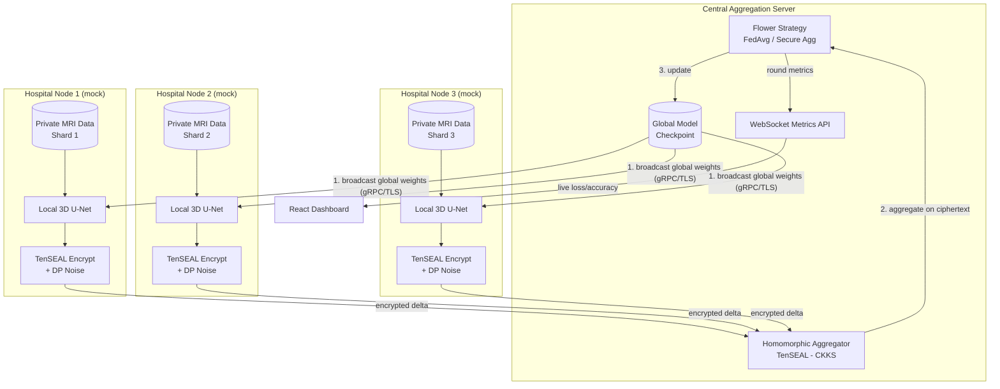
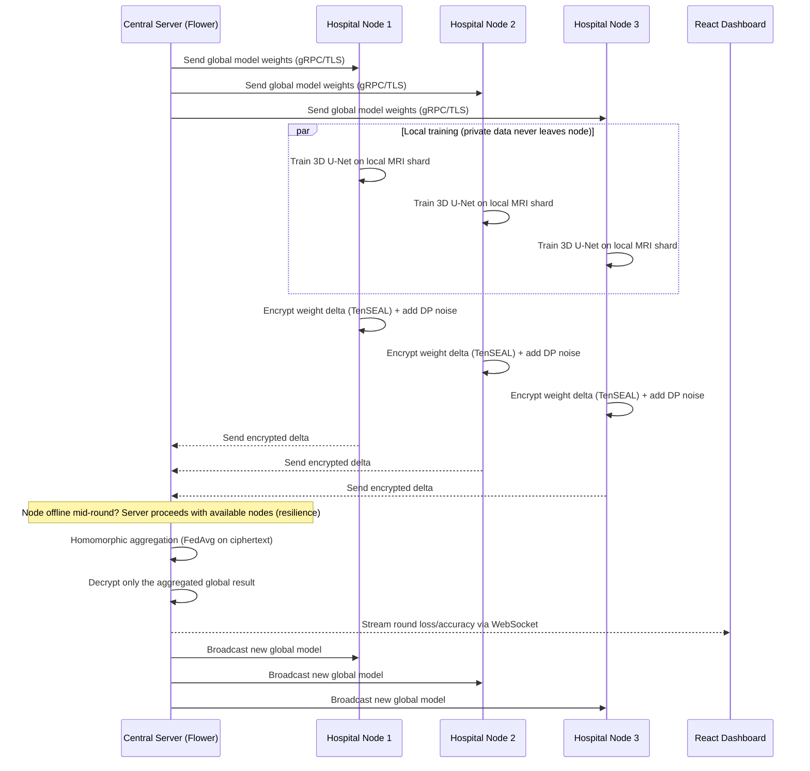

# FedMed — Cross-Silo Federated Learning Engine

**Domain:** Privacy-Preserving Machine Learning (PPML) & Healthcare


> A decentralized deep learning system that trains a brain tumor
> segmentation model across three hospitals — without a single byte of
> patient data ever leaving its source.

## Why This Project Matters

Rare-disease and oncology AI models are chronically data-starved: no single
hospital has enough labeled scans, and HIPAA/GDPR make pooling that data
illegal. FedMed solves this with a full-stack **privacy-preserving ML
pipeline** — not just a federated averaging demo, but a system that layers
**homomorphic encryption**, **differential privacy**, and **secure
transport** on top of federated learning, so the central server *never sees
plaintext weights, let alone raw data*.

**This project demonstrates end-to-end competency across four hard domains
simultaneously:**
- 🧠 **Medical Computer Vision** — 3D U-Net segmentation on volumetric MRI data (MONAI/PyTorch)
- 🌐 **Distributed Systems** — multi-node orchestration, fault tolerance, gRPC+TLS
- 🔐 **Applied Cryptography** — homomorphic encryption (TenSEAL/CKKS) for ciphertext-level aggregation
- 📊 **Full-Stack Delivery** — live React/Recharts dashboard streaming real training metrics via WebSocket

## Problem Statement

Training highly accurate ML models for rare diseases requires massive patient
datasets. Strict data privacy laws (HIPAA/GDPR) prevent hospitals from sharing
raw patient data with a centralized server.

## Use Case

Researchers at three hospitals collaborate to train a brain tumor segmentation
model on MRI scans — without ever pooling raw patient data.

1. A central server sends an untrained PyTorch 3D U-Net model to each hospital node.
2. Each node trains locally on its own private data.
3. Only **encrypted weight updates** (via homomorphic encryption) are sent back.
4. The server aggregates ciphertext updates (Secure Multi-Party Computation)
   to produce a new global model — raw patient data never leaves the hospital.


## 2. Key Modules

| Module | Tech | Responsibility |
|---|---|---|
| Federated Orchestration | **Flower (flwr)** / PySyft | Coordinates rounds: broadcast global model → collect local updates → aggregate → repeat |
| Vision Model | **PyTorch + MONAI** | 3D U-Net for volumetric MRI/CT tumor segmentation |
| Encryption Layer | **TenSEAL** (CKKS Homomorphic Encryption) | Encrypts tensors client-side; server aggregates on ciphertext, never sees plaintext weights |
| Privacy Layer | Differential Privacy (Opacus / manual noise) | Adds calibrated noise to updates to prevent model-inversion / membership-inference attacks |
| Transport | **gRPC + TLS** | Secure, authenticated channel between server and hospital nodes |
| Dashboard | **React + Recharts + WebSocket** | Live view of global loss/accuracy convergence and predicted segmentation masks |

---

## 3. System Architecture



### Federated Training Round — Sequence Flow



---

## 4. Repository Structure

```
fedmed/
├── README.md
├── server/
│   ├── central_server.py          # Flower server + FedAvg strategy
│   ├── he_aggregator.py           # TenSEAL homomorphic aggregation
│   ├── websocket_api.py           # Streams metrics to dashboard
│   └── grpc_certs/                # TLS certs for secure comms
├── node/
│   ├── hospital_node.py           # Flower client wrapper
│   ├── local_trainer.py           # Local PyTorch/MONAI training loop
│   ├── encrypt_utils.py           # TenSEAL client-side encryption
│   └── dp_noise.py                # Differential privacy noise injection
├── model/
│   ├── unet3d.py                  # MONAI 3D U-Net definition
│   └── baseline_train.py          # Centralized baseline (Week 1)
├── data/
│   └── partition_brats.py         # Splits BraTS dataset across 3 mock nodes
├── dashboard/
│   ├── src/
│   │   ├── components/Charts.jsx  # Recharts loss/accuracy curves
│   │   ├── components/MaskViewer.jsx
│   │   └── App.jsx
│   └── package.json
├── tests/
│   └── test_node_resilience.py    # Simulate node dropout mid-round
└── docs/
    └── architecture.md
```

---

## 5. Week-wise Development Plan (with Daily Commit Checkpoints)

> One commit per day minimum — each day below maps to one focused, committable unit of work. Use conventional commit prefixes (`feat:`, `fix:`, `docs:`, `test:`, `chore:`) to keep history clean.

### Week 1 — Baseline Model + Node Scaffolding

| Day | Track | Task | Suggested Commit Message |
|---|---|---|---|
| 1 | Repo Setup | Init repo, folder structure, README skeleton, `.gitignore`, requirements.txt | `chore: initialize FedMed repo structure` |
| 2 | CV Model | Download/prepare BraTS MRI sample data, write data loader | `feat: add BraTS dataset loader` |
| 3 | CV Model | Implement 3D U-Net architecture using MONAI | `feat: implement MONAI 3D U-Net model` |
| 4 | CV Model | Write centralized training loop + loss/metric functions (Dice score) | `feat: add centralized training loop with Dice loss` |
| 5 | CV Model | Train baseline model, log baseline accuracy metrics | `feat: train centralized baseline, log metrics` |
| 6 | Distributed | Install & configure Flower; scaffold 3 mock hospital node scripts on separate ports | `feat: scaffold 3 Flower hospital nodes` |
| 7 | Review | Document baseline results + node scaffolding in `docs/architecture.md` | `docs: week 1 summary and baseline results` |

### Week 2 — Federated Training Loop + Secure Communication (Mid-Project Review)

| Day | Track | Task | Suggested Commit Message |
|---|---|---|---|
| 8 | PPML | Partition BraTS dataset into 3 non-overlapping shards (`partition_brats.py`) | `feat: partition dataset across hospital nodes` |
| 9 | PPML | Implement Flower `NumPyClient` wrapper on each hospital node | `feat: implement Flower client for hospital nodes` |
| 10 | PPML | Implement server-side FedAvg strategy, broadcast/aggregate cycle | `feat: implement FedAvg aggregation strategy` |
| 11 | Distributed | Generate TLS certificates; configure gRPC secure channel | `feat: add TLS certs and secure gRPC channel` |
| 12 | Distributed | Wire Flower to use gRPC+TLS transport, test end-to-end secure round | `feat: enable TLS-secured Flower communication` |
| 13 | Resilience | Implement node dropout handling (server continues with available nodes) | `feat: add node dropout resilience logic` |
| 14 | **Mid Review** | Run full federated audit: compare federated vs. centralized accuracy; write resilience test | `docs: mid-project review — federated audit + resilience proof` |

### Week 3 — Homomorphic Encryption + Live Metrics Streaming

| Day | Track | Task | Suggested Commit Message |
|---|---|---|---|
| 15 | Privacy | Install TenSEAL, set up CKKS encryption context/keys | `feat: configure TenSEAL CKKS encryption context` |
| 16 | Privacy | Encrypt client-side weight tensors before transmission | `feat: encrypt client weight updates with TenSEAL` |
| 17 | Privacy | Implement server-side homomorphic aggregation on ciphertext | `feat: implement homomorphic aggregation on ciphertext` |
| 18 | Privacy | Decrypt only final aggregated global weights; validate correctness vs. plaintext FedAvg | `test: validate HE aggregation against plaintext baseline` |
| 19 | Distributed | Build WebSocket endpoint on server to stream round metrics | `feat: add WebSocket endpoint for live metrics` |
| 20 | Distributed | Connect server training loop to push loss/accuracy per round | `feat: stream training metrics over WebSocket` |
| 21 | Review | Integration test: full encrypted round + live metric stream | `test: end-to-end encrypted round with live metrics` |

### Week 4 — Differential Privacy + Dashboard Polish (Final Review)

| Day | Track | Task | Suggested Commit Message |
|---|---|---|---|
| 22 | Privacy | Implement DP noise injection (Gaussian/Laplacian) on weight deltas | `feat: add differential privacy noise to weight updates` |
| 23 | Privacy | Tune epsilon/delta budget; measure accuracy-vs-privacy tradeoff | `feat: tune DP epsilon-delta privacy budget` |
| 24 | Dashboard | Scaffold React app, connect to WebSocket, render live loss curve (Recharts) | `feat: build React dashboard with live loss chart` |
| 25 | Dashboard | Add accuracy/Dice score chart + round-by-round convergence view | `feat: add convergence and Dice score charts` |
| 26 | Dashboard | Add MRI tumor segmentation mask viewer (predicted vs ground truth) | `feat: add segmentation mask viewer component` |
| 27 | Polish | UI polish, error states, README docs, architecture diagrams finalized | `docs: finalize README and architecture diagrams` |
| 28 | **Final Review** | Full system demo run, record results, write final report | `docs: final report — FedMed complete privacy-first pipeline` |

---

## 6. Milestones Recap

- **Mid-Project Review (Day 14):** Federated model converges near centralized baseline accuracy **without raw data ever leaving a node**; system survives a node dropping mid-round.
- **Final Review (Day 28):** Full pipeline — local training → homomorphic encryption → secure aggregation → differential privacy → live dashboard — demonstrating a compliant, privacy-first healthcare AI architecture.

---

## 7. Tech Stack Summary

- **ML/CV:** PyTorch, MONAI (3D U-Net), BraTS dataset
- **Federated Learning:** Flower (flwr)
- **Privacy:** TenSEAL (Homomorphic Encryption, CKKS scheme), Differential Privacy noise
- **Transport:** gRPC with TLS
- **Frontend:** React, Recharts, WebSocket
- **Testing:** pytest, node-dropout simulation

## 8. Getting Started (fill in as you build)

```bash
# server
cd server && pip install -r requirements.txt
python central_server.py

# hospital node (repeat x3 with different ports)
cd node && python hospital_node.py --port 8081 --data-shard 1

# dashboard
cd dashboard && npm install && npm run dev
```

## 9. License
TBD (e.g., MIT) — add before public release, especially given healthcare-data context (no real patient data should ever be committed to this repo).
