# 🏥 FedMed

### Privacy-Preserving Federated Learning for Medical 

<p align="center">

**Train medical AI collaboratively without sharing patient data.**

<br>

[](#)
[](#)
[](#)
[](#)
[](#)
[](#)

</p>

---

## 📖 Overview

**FedMed** is a cross-silo Federated Learning platform designed for healthcare institutions.

It enables multiple hospitals to collaboratively train a **3D brain-tumor segmentation model** while keeping sensitive MRI scans inside each hospital.

Instead of sending patient data to a centralized server, each hospital trains the model locally and sends only **protected model updates** for global aggregation.

> 🔐 **Raw MRI scans never leave their respective hospital nodes.**

---

### Week-1 Outcome


---

## 📑 Table of Contents

* [Overview](#-overview)
* [Problem Statement](#-problem-statement)
* [How FedMed Works](#-how-fedmed-works)
* [Medical AI Model](#-medical-ai-model)
* [Privacy Architecture](#-privacy-architecture)
* [System Architecture](#️-system-architecture)
* [Tech Stack](#️-tech-stack)
* [Project Structure](#-project-structure)
* [Installation](#️-installation)
* [Dataset](#-dataset)
* [Running FedMed](#️-running-fedmed)
* [Federated Training](#-federated-training)
* [Training Dashboard](#-training-dashboard)
* [Simulating Three Hospitals](#-simulating-three-hospitals)
* [Security Model](#-security-model)
* [Real-World Use Case](#-real-world-use-case)
* [Project Goals](#-project-goals)
* [Future Improvements](#-future-improvements)
* [Why FedMed](#-why-fedmed)
* [Disclaimer](#️-disclaimer)
* [Contributing](#-contributing)
* [License](#-license)

---

# 🎯 Problem Statement

Training accurate machine-learning models for rare diseases requires large and diverse datasets.

However, hospitals often cannot share patient-level medical data because of:

* 🔒 Patient privacy requirements
* ⚖️ Healthcare regulations
* 🏥 Institutional data-sharing policies
* 🛡️ Security concerns
* 📁 Data ownership

FedMed addresses this problem by allowing hospitals to **train collaboratively without centralizing their private datasets**.

### Traditional Medical AI

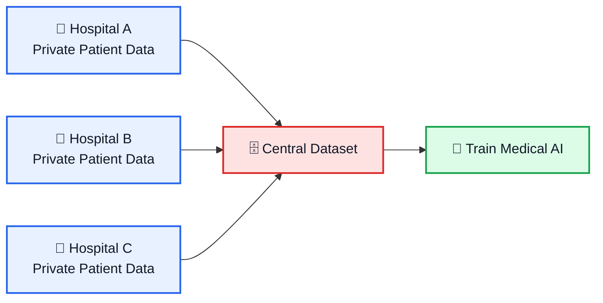

### The Problem

Centralizing medical data creates significant:

**Privacy Risk → Compliance Risk → Security Risk**

---

# 🚀 How FedMed Works

FedMed replaces centralized data collection with **Federated Learning**.

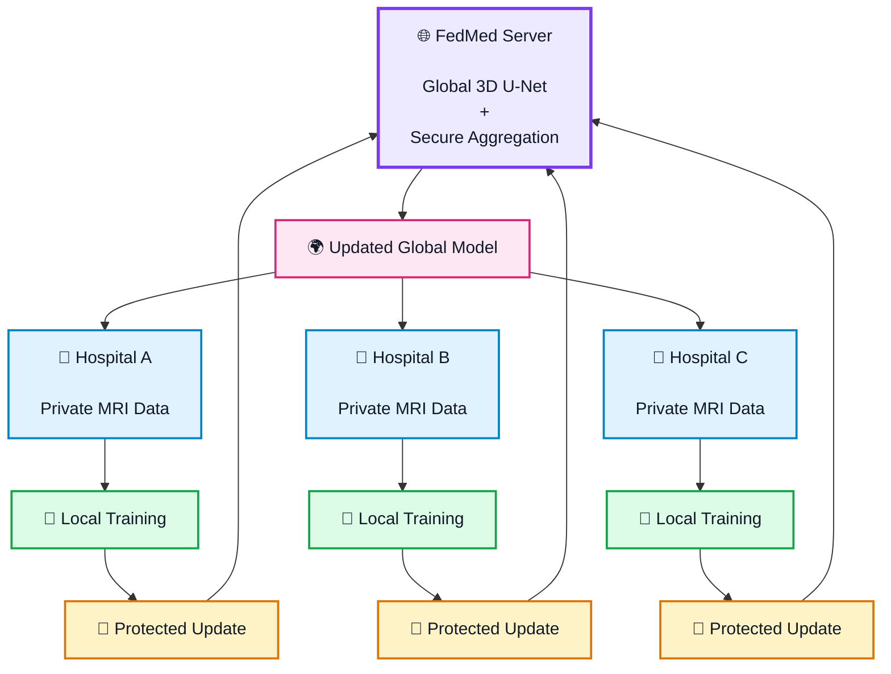

### 🔄 Training Cycle

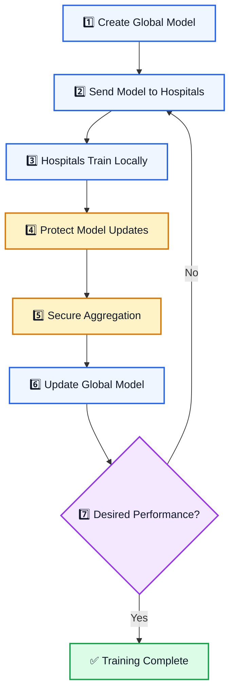

> **The server receives model updates rather than patient MRI data.**

---

# 🧠 Medical AI Model

FedMed uses a **3D U-Net** architecture for volumetric medical-image segmentation.

### Input → Model → Output

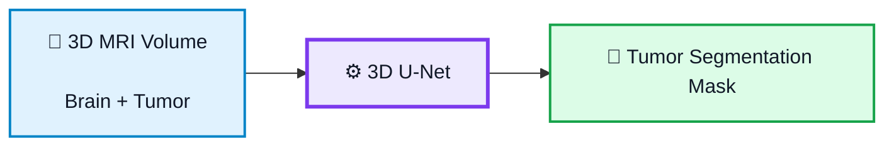

### 📊 Evaluation Metrics

| Metric              | Purpose                         |
| ------------------- | ------------------------------- |
| **Dice Score**      | Measures segmentation overlap   |
| **IoU**             | Intersection over Union         |
| **Validation Loss** | Measures model error            |
| **Precision**       | Measures prediction correctness |
| **Recall**          | Measures detection coverage     |

---

# 🔐 Privacy Architecture

FedMed uses multiple privacy mechanisms.

## 1. Federated Learning

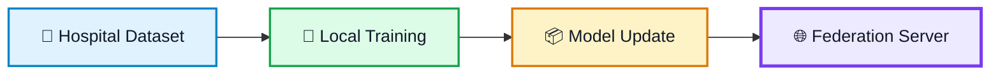

**Patient data stays inside the hospital.**

---

## 2. 🔒 Homomorphic Encryption

FedMed uses **TenSEAL** to protect model updates.

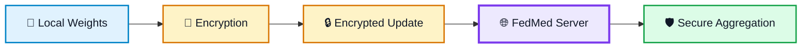

The goal is to allow aggregation of protected values without requiring the server to access the underlying plaintext updates.

---

## 3. 🛡️ Secure Aggregation

The aggregation layer is designed to prevent the server from directly inspecting an individual hospital's contribution.

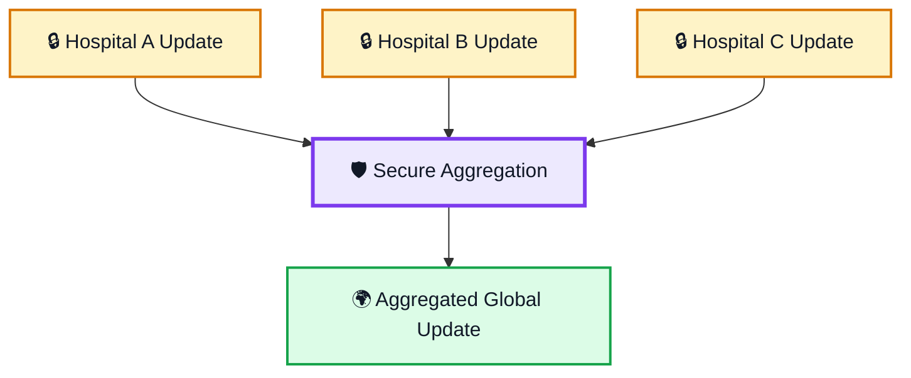

> ⚠️ **Important:** FedMed is designed to improve privacy; it should not be interpreted as providing absolute or mathematically complete privacy under every possible threat model.

---

# 🏗️ System Architecture

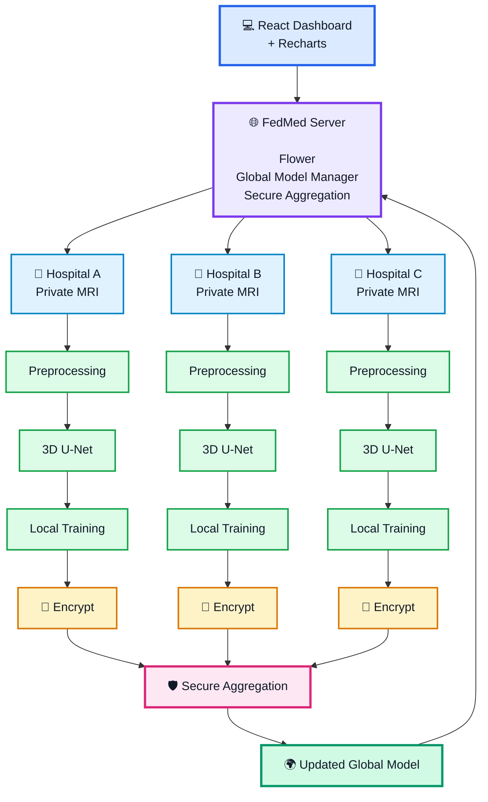

---

# 🛠️ Tech Stack

## Machine Learning

| Technology      | Role               |
| --------------- | ------------------ |
| 🐍 **Python**   | Core development   |
| 🔥 **PyTorch**  | Deep learning      |
| 🏥 **MONAI**    | Medical AI         |
| 🧠 **3D U-Net** | Image segmentation |

## Federated Learning

| Technology    | Role                             |
| ------------- | -------------------------------- |
| 🌸 **Flower** | Federated learning orchestration |

## Privacy & Security

| Technology                    | Role                           |
| ----------------------------- | ------------------------------ |
| 🔐 **TenSEAL**                | Homomorphic encryption         |
| 🔒 **Homomorphic Encryption** | Protected computation          |
| 🛡️ **Secure Aggregation**    | Privacy-preserving aggregation |

## Frontend

| Technology      | Role               |
| --------------- | ------------------ |
| ⚛️ **React**    | Dashboard          |
| 📊 **Recharts** | Data visualization |

## Data

* MRI / CT volumetric medical images
* NIfTI-compatible preprocessing
* DICOM-compatible preprocessing

---

# 📂 Project Structure

```text
FedMed/
│
├── server/
│   ├── server.py
│   ├── aggregation.py
│   └── config.py
│
├── clients/
│   ├── hospital_a/
│   │   ├── client.py
│   │   ├── dataset.py
│   │   └── config.py
│   │
│   ├── hospital_b/
│   │   ├── client.py
│   │   ├── dataset.py
│   │   └── config.py
│   │
│   └── hospital_c/
│       ├── client.py
│       ├── dataset.py
│       └── config.py
│
├── models/
│   ├── unet3d.py
│   ├── loss.py
│   └── metrics.py
│
├── privacy/
│   ├── encryption.py
│   └── secure_aggregation.py
│
├── preprocessing/
│   ├── preprocessing.py
│   └── transforms.py
│
├── dashboard/
│   ├── src/
│   ├── package.json
│   └── README.md
│
├── data/
│   └── README.md
├── requirements.txt
├── docker-compose.yml
└── README.md
```

---

# ⚙️ Installation

## 1. Clone the repository

```bash
git clone https://github.com/<your-username>/FedMed.git
cd FedMed
```

## 2. Create a Python environment

```bash
python -m venv venv
```

### Windows

```bash
venv\Scripts\activate
```

### Linux / macOS

```bash
source venv/bin/activate
```

## 3. Install dependencies

```bash
pip install -r requirements.txt
```

### Example dependencies

```text
torch
torchvision
monai
flwr
tenseal
numpy
pandas
scikit-learn
nibabel
pydicom
```

## 4. Install frontend dependencies

```bash
cd dashboard
npm install
```

---

# 📊 Dataset

FedMed is designed for volumetric medical-imaging datasets.

A suitable dataset should contain:

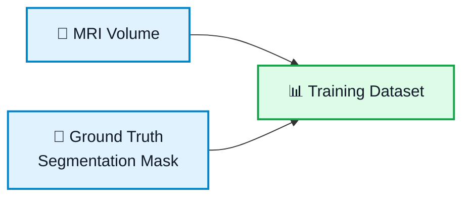

For development, the dataset can be divided into three simulated hospital datasets:

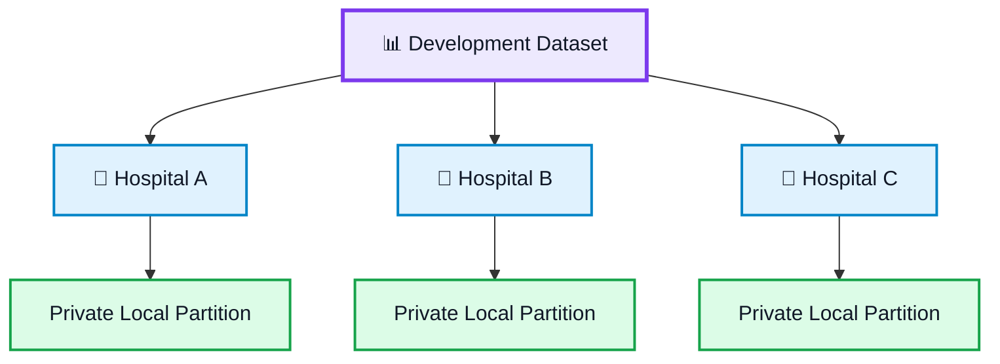

> ⚠️ **Never upload real patient-identifiable medical data to this repository.**

For demonstrations and development, use:

* Publicly available de-identified datasets
* Synthetic medical data
* Artificially generated datasets

---

# ▶️ Running FedMed

### Start the federated server

```bash
python server/server.py
```

### Start Hospital A

```bash
python clients/hospital_a/client.py
```

### Start Hospital B

```bash
python clients/hospital_b/client.py
```

### Start Hospital C

```bash
python clients/hospital_c/client.py
```

---

# 🔄 Federated Training

A complete training round:

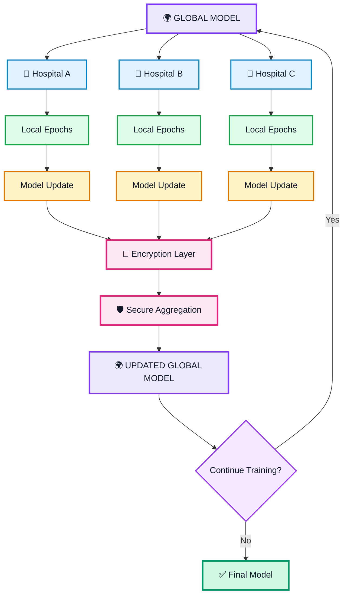

This process continues until the global model reaches the desired performance.

---

# 📈 Training Dashboard

The React dashboard provides real-time visibility into federated training.

### Dashboard Metrics

| Metric                   | Description                          |
| ------------------------ | ------------------------------------ |
| **Federated Round**      | Current global training round        |
| **Global Loss**          | Loss of the global model             |
| **Dice Score**           | Segmentation quality                 |
| **IoU**                  | Intersection over Union              |
| **Hospital Status**      | Client connection/training status    |
| **Training Time**        | Time taken per round                 |
| **Client Participation** | Hospitals participating in the round |

### Dashboard Flow

```mermaid
flowchart LR
    A["🌐 Federated Server"]
    B["📡 Training Metrics"]
    C["💻 React Dashboard"]
    D["📊 Recharts"]
    E["👨‍💻 Developer / Researcher"]

    A --> B --> C --> D --> E

    classDef server fill:#EDE9FE,stroke:#7C3AED,stroke-width:3px,color:#111827
    classDef metrics fill:#FEF3C7,stroke:#D97706,stroke-width:2px,color:#111827
    classDef dashboard fill:#DBEAFE,stroke:#2563EB,stroke-width:3px,color:#111827
    classDef chart fill:#DCFCE7,stroke:#16A34A,stroke-width:2px,color:#111827
    classDef user fill:#F3F4F6,stroke:#6B7280,stroke-width:2px,color:#111827

    class A server
    class B metrics
    class C dashboard
    class D chart
    class E user
```

---

# 🧪 Simulating Three Hospitals

For a hackathon or local demonstration, three hospitals can be simulated as three isolated clients.

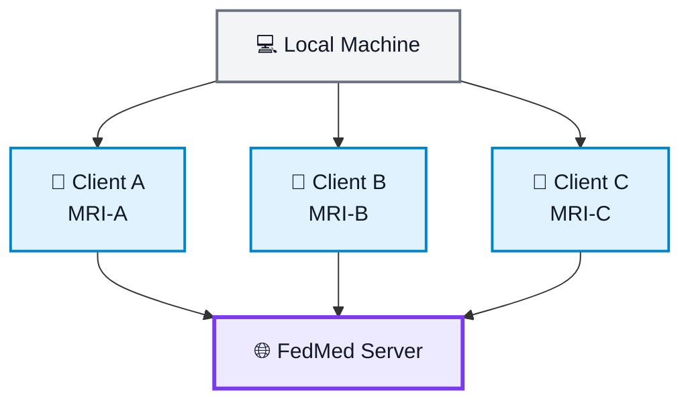

Each client can have:

* Different patient distributions
* Different image counts
* Different tumor characteristics
* Different local validation data

This makes the demonstration more realistic than simply splitting identical batches.

---

# 🔒 Security Model

## Data That Stays Local

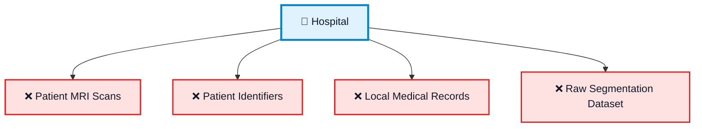

## Data Exchanged

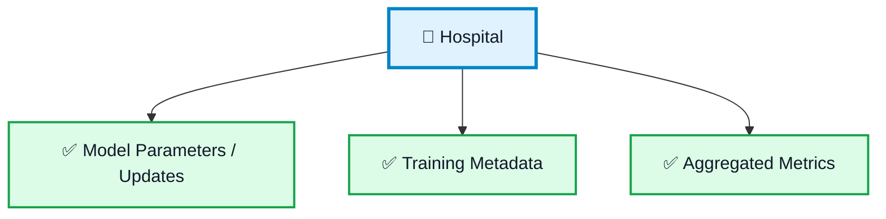

Model updates should be protected before transmission using the configured privacy layer.

---

# 🌍 Real-World Use Case

Imagine three hospitals located in different countries.

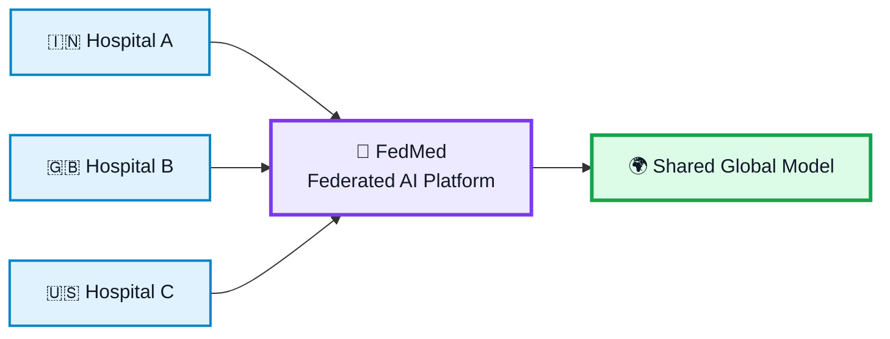

Each institution contributes to a shared AI model while maintaining control over its own patient dataset.

### Potential Applications

* 🧠 Brain tumor segmentation
* 🫁 Lung disease detection
* 🎗️ Cancer classification
* 👁️ Retinal disease detection
* 🧠 Stroke prediction
* 🧬 Rare disease research

---

# 🎯 Project Goals

### ✅ Completed

* [x] Federated Learning architecture
* [x] Distributed hospital clients
* [x] Local model training
* [x] 3D medical-image segmentation
* [x] Encrypted model updates
* [x] Secure aggregation architecture
* [x] Training monitoring dashboard

### 🚧 Planned

* [ ] Multi-GPU distributed training
* [ ] Differential Privacy
* [ ] Production-grade authentication
* [ ] Kubernetes deployment
* [ ] Real-world multi-institution deployment

---

# 🚧 Future Improvements

### 🔐 Differential Privacy

Add noise to updates to provide stronger protection against model-inversion and membership-inference attacks.

### 🪪 Client Authentication

Introduce secure hospital identity management using certificates or public-key infrastructure.

### 🔄 Fault Tolerance

Allow training to continue when one or more hospital nodes temporarily disconnect.

### 📦 Non-IID Data Handling

Medical datasets can differ significantly between hospitals.

Future versions can implement:

* FedProx
* Personalized Federated Learning
* Adaptive aggregation
* Client weighting

### 🛡️ Advanced Privacy

Potential future additions include:

* Differential Privacy
* Secure Multi-Party Computation
* Trusted Execution Environments
* Byzantine-robust aggregation

---

# 🏆 Why FedMed?

## Traditional Centralized ML

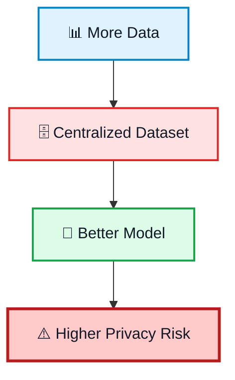

## FedMed

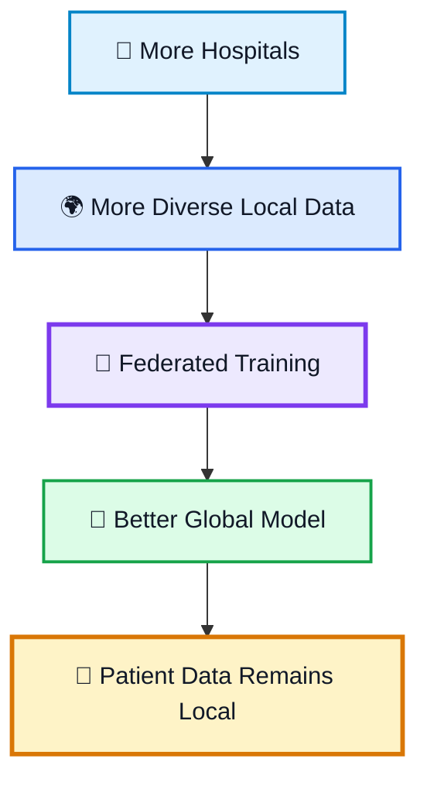

> 💡 **FedMed demonstrates how privacy-preserving machine learning can make cross-institution medical AI collaboration possible.**

---


# ⚠️ Disclaimer

FedMed is an **educational/research prototype** and is **not intended for clinical diagnosis or treatment**.

The privacy and security guarantees of a real-world deployment depend on the complete system architecture, threat model, encryption configuration, authentication, infrastructure, and regulatory requirements.

> 🚨 **Do not use real patient-identifiable data in development or demonstration environments without appropriate authorization and safeguards.**

---

# 🤝 Contributing

Contributions are welcome!

### Create a feature branch

```bash
git checkout -b feature/your-feature
```

### Stage changes

```bash
git add .
```

### Commit

```bash
git commit -m "Add your feature"
```

### Push

```bash
git push origin feature/your-feature
```

Then open a **Pull Request** on GitHub.

---

# 📜 License

This project is intended for **research and educational purposes**.

Add your preferred open-source license here, for example:

```text
MIT License
```

---

# 👨‍💻 Built With

<p align="center">

🐍 **Python**
🔥 **PyTorch**
🏥 **MONAI**
🌸 **Flower**
🔐 **TenSEAL**
⚛️ **React**
📊 **Recharts**

</p>

---

<p align="center">

# 🏥 FedMed

### **Collaborative Intelligence. Private Data. Better Healthcare.**

</p>
